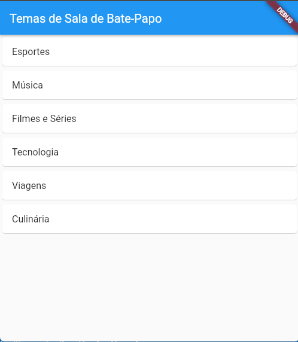

# **Desafio Dio - Projeto Potencializando o seu App Flutter com Cloud Firestore**


Este projeto tem como objetivo ensinar a você como usar o Cloud Firestore, um serviço de banco de dados NoSQL do Google, para criar um app Flutter. 

### Ao longo do projeto, você aprenderá a:

- Criar um projeto no Firebase e adicionar o Cloud Firestore ao seu app Flutter
- Criar e atualizar dados no Cloud Firestore
- Ler dados do Cloud Firestore
- Utilizar o Cloud Firestore em conjunto com o Firebase Authentication


### Para criar este projeto, você precisará de:

- Um computador com instalado o Flutter
- Uma conta no Google Cloud Platform


Para começar, crie um projeto no Firebase. Em seguida, adicione o Cloud Firestore ao seu app Flutter. Para isso, siga as instruções do tutorial oficial do Flutter: https://firebase.google.com/docs/flutter/setup.

Uma vez que você tenha adicionado o Cloud Firestore ao seu app Flutter, você estará pronto para começar a criar e atualizar dados no banco de dados. Para isso, você pode utilizar a classe `Firestore`:


```plaintext
import 'package:cloud_firestore/cloud_firestore.dart';

Firestore db = Firestore.instance;

// Cria um documento no banco de dados
db.collection('users').document('meu_id').setData({
  'nome': 'Fulano de Tal',
  'idade': 20,
});

// Atualiza um documento no banco de dados
db.collection('users').document('meu_id').updateData({
  'idade': 21,
});

// Lê um documento do banco de dados
DocumentSnapshot snapshot = await db.collection('users').document('meu_id').get();

// Imprime o nome do usuário no console
print(snapshot.data['nome']);
```


Além de criar e atualizar documentos, você também pode ler documentos do banco de dados. Para isso, você pode utilizar a classe `DocumentSnapshot`:


```plaintext
DocumentSnapshot snapshot = await db.collection('users').document('meu_id').get();

// Imprime o nome do usuário no console
print(snapshot.data['nome']);
```

Por fim, você também pode utilizar o Cloud Firestore em conjunto com o Firebase Authentication. Para isso, você pode utilizar a classe `User`:


```plaintext
User user = await FirebaseAuth.instance.currentUser();

// Cria um documento no banco de dados
db.collection('users').document(user.uid).setData({
  'nome': user.displayName,
  'email': user.email,
});
```


O Cloud Firestore é uma ferramenta poderosa que pode ser utilizada para criar aplicativos Flutter robustos e escaláveis. Este projeto forneceu uma introdução básica ao uso do Cloud Firestore, mas você pode aprender mais sobre o banco de dados consultando a documentação oficial: https://firebase.google.com/docs/firestore/.


### **Módulo 1: Configuração do Firestore**

Para configurar o Firestore no seu projeto Flutter, siga os seguintes passos:

1. Adicione a dependência `cloud_firestore` ao seu arquivo `pubspec.yaml`.

```plaintext
dependencies:
  cloud_firestore: ^0.14.0+2
```

2. Importe o pacote `cloud_firestore` no seu código Dart.

```plaintext
import 'package:cloud_firestore/cloud_firestore.dart';
```

3. Inicialize o Firestore no seu aplicativo.

```plaintext
Firestore db = Firestore.instance;
```


### **Módulo 2: Autenticação de Usuários**

Para configurar a autenticação de usuários com o Firebase Auth, siga os seguintes passos:

1. Adicione a dependência `firebase_auth` ao seu arquivo `pubspec.yaml`.


```plaintext
dependencies:
  firebase_auth: ^0.18.0+1
```


3. Importe o pacote `firebase_auth` no seu código Dart.

```plaintext
import 'package:firebase_auth/firebase_auth.dart';
```


4. Inicialize o Firebase Auth no seu aplicativo.

```plaintext
FirebaseAuth auth = FirebaseAuth.instance;
```

1. Implemente os métodos de autenticação, como registro, login e logout.


### **Módulo 3: Estruturação dos Dados**

Para estruturar seus dados no Firestore, considere o seguinte:

- **Coleções:** Agrupam documentos relacionados.
- **Documentos:** Contêm os dados reais.
- **Campos:** Representam as propriedades dos documentos.

Para um app de chat, você pode ter as seguintes coleções:

- `usuarios`
- `salas`
- `mensagens`


### **Módulo 4: UI do Chat**

Para desenvolver a interface do usuário do seu app de chat, use o Flutter. Crie uma lista de salas e uma tela de mensagens.


### **Módulo 5: Integração com Firestore**

Para integrar o Firestore com seu app, use os seguintes métodos:

- `db.collection('colecao').document('documento').setData()` para salvar dados.
- `db.collection('colecao').document('documento').get()` para recuperar dados.
- `StreamBuilder` para ouvir atualizações de dados em tempo real.


### **Módulo 6: Testes e Depuração**

Para testar seu aplicativo, verifique:

- Autenticação de usuários
- Envio e recebimento de mensagens
- Persistência dos dados


### **Módulo 7: Personalização e Branding**

Para personalizar seu aplicativo, use temas, cores e fontes. Alinhe a aparência do seu app com sua marca ou identidade pessoal.


#### **Exemplo Prático**

Para ouvir as mensagens de uma sala de chat usando o Firestore:

```plaintext
StreamBuilder(
  stream: Firestore.instance.collection('chat_room').document(roomId).collection('messages').snapshots(),
  builder: (context, snapshot) {
    if (!snapshot.hasData) return Center(child: CircularProgressIndicator());
    
    var messages = snapshot.data.documents;
    return ListView.builder(
      itemCount: messages.length,
      itemBuilder: (context, index) => ListTile(
        title: Text(messages[index]['text']),
        subtitle: Text(messages[index]['sender']),
      ),
    );
  },
)
```

Lembre-se de aplicar os conceitos aprendidos e seguir as dicas do Instrutor Danilo para aprimorar seu aplicativo de chat. Esses módulos fornecerão uma base sólida para você criar um app robusto e personalizado com Flutter e Firestore.


# Potencializando o seu App Flutter com Cloud Firestore

- 


## Checklist do Desafio
- [x] Criar uma aplicação Flutter​
- [x] Criar banco de dados no Firestore​
- [x] Criar uma tela de escolha de salas​
- [ ] Criar chat separado por salas​
- [ ] Usuário informará o nome​
- [ ] Incluir recursos a escolha do(a) aluno(a)


## Slides

[Introdução ao Firebase](https://academiapme-my.sharepoint.com/:p:/g/personal/nubia_dio_me/EY_QaAs2-XlOg2qUmPrtbDUBQr5wgjGPU4VRoU2_w_IrRA?e=Oh15x3)

Bons estudos 😉

## Telas

